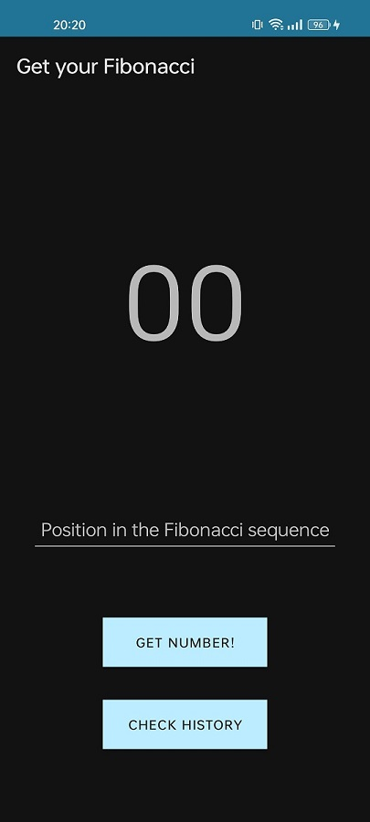
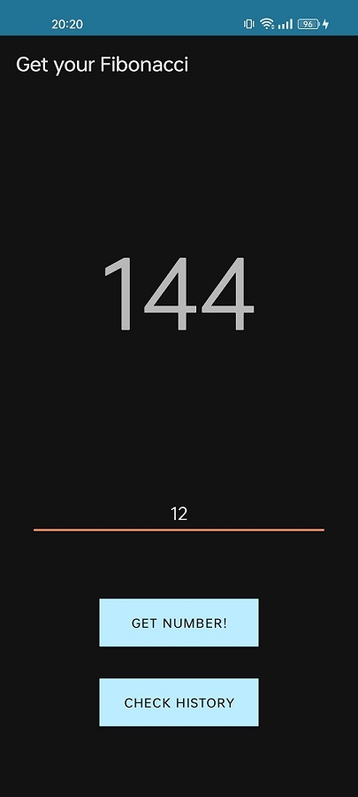
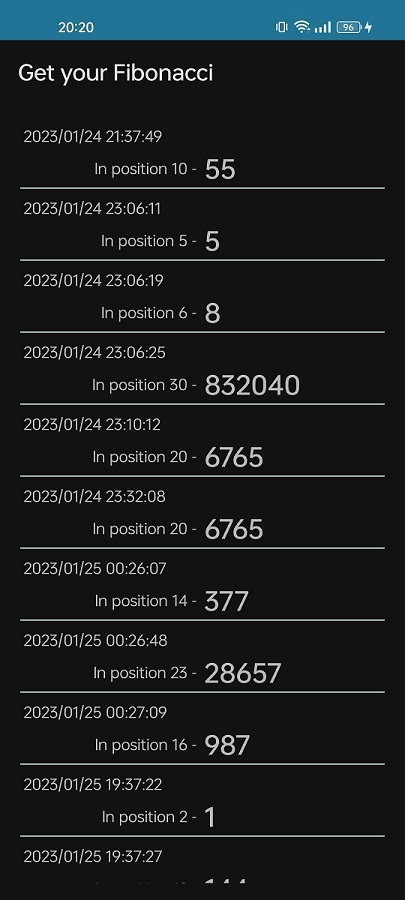

# Get your Fibonacci

### Description

Get your Fibonacci is the app that gives you a Fibonacci number according to the position in the sequence that you provide.

It is a very simple app made up of two activities: MainActivity, and RecordsActivity.

## *MainActivity*

It holds the core of the app's behaviour. It looks like this:

You can enter a number in the "edit text", and if you click on "get number!" button you will get the Fibonacci number in that position in the sequence. This number will be shown in the big top text. This can be seen here:

However, if you click on "check history", it gets you to the second activity.

## *RecordsActivity*

This activity shows a list of the records generated when asking for a Fibonacci number. The records are shown with the date and time when they were asked for, the position in the sequence that was provided, and the number that corresonds to that position in the series. This is shown here:

---

### Coding choices

In the development of this application functionality was prioritized. With this it is meant that not much time was spent in thinking of the design of it (UI), but most of it was for thinking about a very good functionality and the best user experience (least clicks to get to different places, and a good understanding of the actions to be performed). However, it was always a priority to keep a very clean visualization of the elements.

It is developed using two Android Activities. This was the easiest and quickest way of adding two different functionalities in two different visual spaces with the least amount of code.

In MainActivity:
- Only 3 UI elements are used textView, editText and buttons;
- just one function (*computeFibonacci()*) does the job for getting the Fibonacci number;
- and only one function (*saveRecord()*) puts the data in a file to keep it persistent between sessions.

In RecordsActivity:
- A *RecyclerView* helps setting the data in a list format;
- 2 functions (*getRecords()* and *getDataFromFile()*) read the files and obtain the data to be shown;
- and a *Record* object helps organizing and serializing data to keep the code clear.